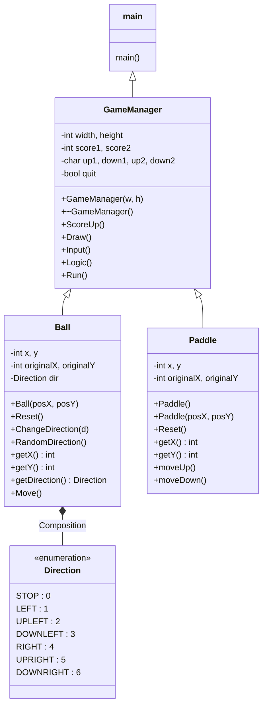

# Pong Game

This is a simple pong game built using C++. There will be two players in the game "Player 1" and "Player 2". They have to hit the ball, if ball touches left wall then Player 2 won. If ball touches right wall then Player 1 won. Their score will be increased by 1 points.

<br/>

## Screenshots
<div align="center">


 
</div>


<br/>

## How to play
You can press these keys to change the direction of the paddle.

\
To move Player 1 paddle :

| Key   | Direction   |
|:-----:|:-----------:|
| w     | UP          |
| s     | DOWN        |

<br/>

To move Player 2 paddle :

| Key    | Direction    |
|:------:|:------------:|
| i      | UP           |
| k      | DOWN         |

<br/>

To exit the Pong Game :

| Key    | Direction    |
|:------:|:------------:|
| q      | QUIT         |

<br/>


<br/>

## Libraries we'll need

- [**conio.h**](https://en.wikipedia.org/wiki/Conio.h) : For console input and output. For windows systems you can download the file. For linux systems that file is in the repository.
   ##### For Linux
   - **uninst.h** : usleep() function in linux systems, to slow down the game. usleep() function suspends execution for microsecond intervals.
  ##### For Windows
   - **Windows.h** : Sleep() function in windows systems, to slow down the game. Sleep() function suspends execution for second intervals.

**Other libraries are included in cpp files**

<br/>

## To run the game

<span style="background-color: #eeeeee">&nbsp;&nbsp;cmake .&nbsp;</span>does the compiler detection, evaluates the <span style="background-color: #eeeeee">&nbsp;CMakeLists.txt&nbsp;</span> in the given <span style="background-color: #eeeeee">&nbsp;.&nbsp;</span> director and generates the build environment in the current working directory.<br/>The <span style="background-color: #eeeeee">&nbsp;cmake --build .&nbsp;</span> command is an abstraction for the necessary build/make call.


To keep source code clean from any build artifacts you should do "out-of-source" builds.\
\
run [cmake](https://en.wikipedia.org/wiki/CMake) :
```bash
  mkdir build
  cd build
  cmake ..
  cmake --build .
```
\
and finally run [make](https://en.wikipedia.org/wiki/Make_%28software%29) :
```bash
  make
```
\
To run the game :
```bash
  ./game
```

<br/>

## UML Diagram

And this will produce a flow chart:


<div>


</div>


<br/>

## Support

<a href="https://www.buymeacoffee.com/jordian" target="_blank" style="margin-left: 50px"></a>
